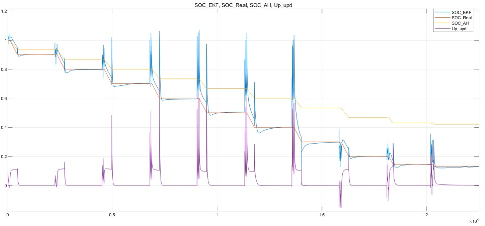
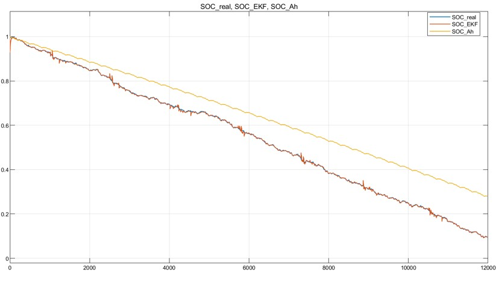
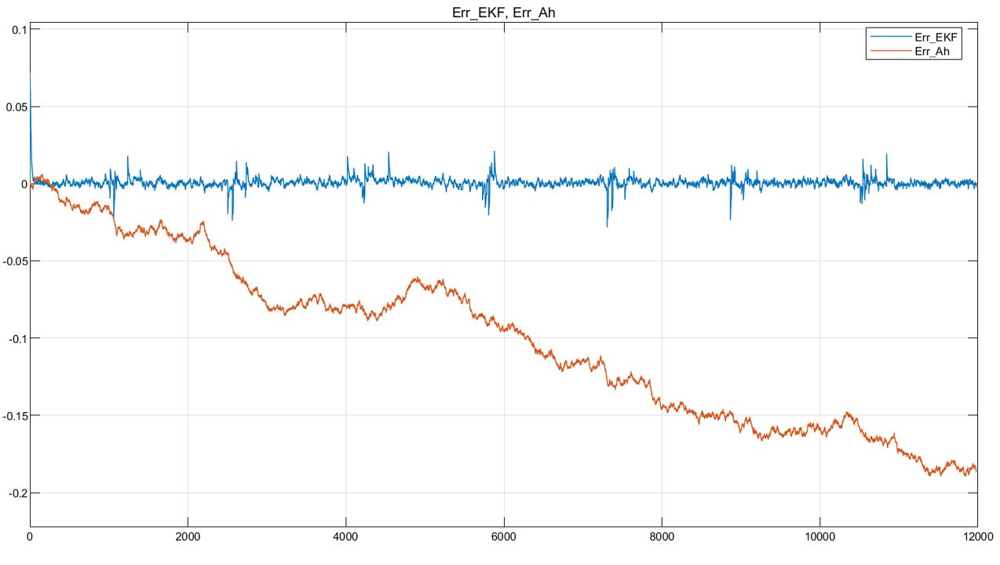

# 电池SOC估计-卡尔曼滤波

[English](./README.md)

这个小项目来自于我大学毕业设计的放着模拟部分，目的是估计锂电池的荷电状态(SOC)。主要完成了扩展卡尔曼滤波(EKF)的实验、参数辨识和仿真。完成无迹卡尔曼滤波(UKF)仿真需要感谢我的朋友顾鹏程的贡献。BBDST的工作环境也得益于我的师兄蒋聪的帮助。😘🔋谢谢我的小伙伴们🔋❤
## 内容

项目中包括锂电池模型建立、参数辨识与验证、SOC估计采用扩展卡尔曼滤波(EKF)，使用了两种方式实现：

1. Simulinks(EKF only)
2. 脚本(包含EKF和UKF)

## 第一次尝试

该模型的输入包括电流和电压来自于HPPC（混合脉冲功率特性）测试的电池数据。

文件EKFSim_R2016中使用了Thevenin等效电路模型和扩展卡尔曼滤波器，结构如下。


估计曲线在电流脉冲区域有明显的发散，在恒流放电区域逐渐收敛到真实值。

SOC和Up(RC元件在Thevenin ECM中的电压)的估计值同步变化，这是由于它们处于相同的状态向量中而，这可以在功能块“EKF”中看到。

卡尔曼滤波根据UL(负载电压)的观测值与预测值的差，对包括SOC和Up在内的状态组进行更新。代码表达如下。  

```matlab
X_upd = X_pre + K*(UL_obs-UL_pre);
```

仿真输出如下图所示。




## 改进

在改进之后，模块之间的I/O关系变得更加清晰，相应的Simulink文件命名为Improved_EKFSim。


这里使用BBDST（北京公交车动态街道测试）工况作为输入电流。


The output results are shown in the figures belows.





## 脚本

脚本文件可以仿真在 BBDST 工况和带有观测噪声的恒流工况下的锂离子电池放电过程，利用EKF/UKF方法估算电池荷电状态。

```matlab
function main(Work_modes, SOC_est_init)
```

主函数需要两个参数：

- Work_mode: 工况选择。1 - BBDST 工况，2 - 恒流工况

- SOC_est_init: SOC估计值的初始值。在只传递一个参数的情况下，其默认为1。

在命令窗口中输入`main()`或`main(1)`或`main(1,1)`，结果如下。


## 相关知识

### 1. Thevenin 等效电路模型（ECM）

Thevenin ECM 是一阶RC电路。如下如所示，将放电的正方向作为电流正方向。


将极化电容两端的电压表示为 Up，根据 KVL 和 KCL 可得下式，

```
UL(t) = UOC - Up(t) - Ro * I(t)              ······(1)
I(t) = Up(t) / Rp - Cp * (dUp(t)/dt)         ······(2)
```

式(2)的解如下，

```
Up(t) = C * exp(-t/tao) + I(t) * Rp          ······(3)
tao = Rp * Cp                                ······(4)
```

这里 `C` 是一个任意常数。电路的零输入响应对应于搁置状态的电池，而零状态响应对应于工作状态的电池。不同状态下，Up 的离散形式可以统一表示为下式。

```
Up(k+1) = Up(k) * exp(-Δt/tao) + 
          Rp * I(k) * (1 - exp(-Δt/tao))     ······(5)
```

这里 `Δt` 代表采样间隔。 Thevenin ECM 中的参数（包括 `UOC`, `Ro`, `Rp` 和 `Cp`）被认为和 SoC 有关. 他们和 SoC 之间关系通常通过所谓的混合脉冲动力特性测试（HPPC）进行辨识。

### 2. 扩展卡尔曼滤波（EKF）

基本卡尔曼滤波的本质就是融合预测信息和观测信息的过程，前提假设是过程误差和观测误差都是服从高斯分布的随机噪声。EKF主要包括三个步骤：预测、线性化和更新。

```
_______________________________________________________
|                                                     |
|    |----------|     |-------------|     |------|    |
---->|prediction|---->|linearization|---->|update|-----
     |----------|     |-------------|     |------|
```

预测过程需要的是状态转移的知识（其表示为式(5)和式(6)）和观测估计的知识（其表示为(7)和式(8)）。

```
SoC(k) = SoC(k-1) - eta/Qn * I(k-1)          ······(6)
UL(k) = UOC(k-1) - I(k-1) * Ro - Up(k-1)     ······(7)
UOC(k) = f(SoC(k-1))                         ······(8)
```

这里 `eta` 和 `Qn` 分别表示库伦效率和电池额定容量。令 `X` 为状态向量 `[SoC, Up]'`，`A` 为状态转移矩阵 `[1, 0; 0, exp(-Δt/tao)]`，`B` 为输入控制矩阵 `[-eta/Qn, 0; 0, Rp*(1-exp(-Δt/tao))]`，那么式(5)和式(6)可以表示为下式。

```
X(k) = A * X(k-1) + B * I(k-1)               ······(9)
```

卡尔曼滤波利用过程噪声和观测噪声进行状态估计。其后一个重要步骤是过程误差协方差矩阵 `P` 的预测。

```
P(k) = A(k-1) * P(k-1) * A'(k-1) + Q        ······(10)
```

这里 `Q` 是一个包含过程噪声方差的对角矩阵。对于状态向量 `X=[SoC, Up]'`，`Q` 是一个 2x2 对角阵 `[Qs, 0; 0, Qu]`。其中 `Qs` 是`SoC` 的过程噪声方差，`Qu` 是 `Up` 的过程噪声方差。

注意 `UOC` 是一个关于 `SoC` 的非线性函数，这使得 `UL=g(X, I)` 也是非线性的。

线性化就是对 `g(X, I)` 在 `X(k)` 处进行一阶近似泰勒展开。

```
UL = g(X(k), I(k)) + əg/əX(k) * (X - X(k))  ······(11)
C(k) = əg/əX(k)
     = [əg/əSoC(k) əg/əUp(k)]
     = [ə(UoC-Ro*I(k))/əSoC(k) -1]          ······(12)
```

因此 `UL = C(k) * X + (g(X(k), I(k)) - C(k)*X(k))`. 此处 `C(k)` 是一个常数矩阵， `(g(X(k), I(k)) - C(k)*X(k))` 同样是常数. 到此就完成了线性化.

在线性化的结果基础之上，更新步骤利用观测噪声 `R` 和观测值 `UL_ob` 更新状态向量和过程误差协方差。


```
K(k) = P(k) * C'(k) * 
       (C(k) * P(k) * C'(k) + R)^(-1)       ······(13)
X(k) = X(k) + K(k) * (UL_ob - UL(k))        ······(14)
P(k) = P(k) - K(k) * C(k) * P(k)            ······(15)
```

[这篇文章](https://courses.engr.illinois.edu/ece420/sp2017/UnderstandingKalmanFilter.pdf)给出了关于卡尔曼滤波的一个较为直观的推导. [这篇文章](https://www.cs.ubc.ca/~murphyk/Papers/Julier_Uhlmann_mar04.pdf)里给出了有关UKF的详细解释.